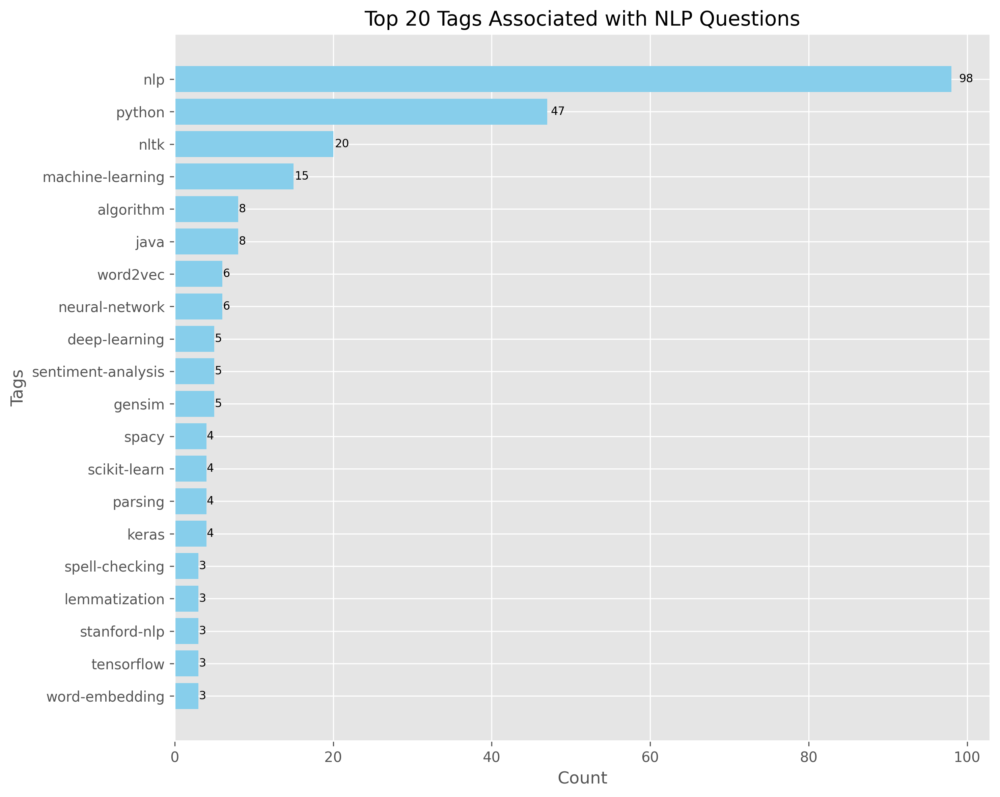
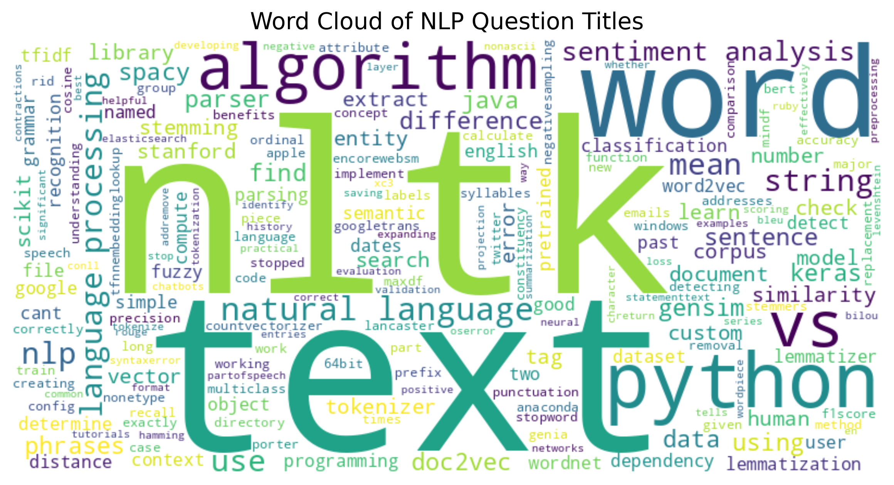

# NLP Knowledge Base 📚

A comprehensive collection of NLP questions, answers, and insights organized by different categorization schemes. This project provides a web interface to explore and search through curated NLP-related content from Stack Exchange.

by [**Shubharthak**](https://shubharthaksangharsha.github.io/)

[](https://nlp-assignment.duckdns.org/)

> 🔗 [**Live Demo**](https://nlp-assignment.duckdns.org/) | [**Documentation**](src/README.md) | [**Web App**](web-app/README.md)

---

## ✨ Features

### 📊 Multiple Categorization Schemes
- **Task-based**: Text Classification, Sentiment Analysis, etc.
- **Keyword-based**: Implementation Issues, Library Usage, etc.
- **Library-based**: NLTK, spaCy, BERT, etc.
- **Question Type**: How, What, Why, etc.

### 📝 Rich Content
- 🔍 Curated questions and answers
- 💻 Code examples
- 🛠️ Implementation details
- ✅ Best practices
- ❗ Common issues and solutions

### 🌐 Modern Web Interface
- 🎨 Clean and responsive design
- 🧭 Easy navigation
- 📂 Category browsing
- 🔍 Search functionality
- 🌓 Dark/Light mode toggle

---

## 📊 Insights

<div align="center">
  
  <p><em>Word Cloud of NLP Topics</em></p>
</div>

---

## 🗂️ Project Structure

```
nlp_knowledge_base/
├── 📁 src/                
│   ├── 📜 data_collector.py   
│   ├── 📜 preprocessor.py     
│   ├── 📜 data_visualizer.py  
│   ├── 📜 categorizer.py      
│   └── 📜 main.py             
├── 📁 data/
│   └── 📁 categories/     # Processed data files
│       ├── 📁 keyword_based/
│       ├── 📁 task_based/
│       ├── 📁 library_based/
│       └── 📁 question_type/
├── 📁 web-app/           # Web application
│   ├── 📜 app.py         # Flask application
│   ├── 📁 static/        # Static assets
│   └── 📁 templates/     # HTML templates
├── 📜 vercel.json       # Vercel deployment config
└── 📜 requirements.txt  # Python dependencies
```

## 🚀 Getting Started

### ⚠️ IMPORTANT: Dataset Setup
You **MUST** download and unzip the dataset before running the application:

1. **Download the dataset** from the link below:
   [🔽 Click here to download the dataset](https://drive.google.com/file/d/1EPZ6mJvLAj0sJqNAWWLo8Bz90K2sSBgy/view?usp=sharing)

2. **Unzip the dataset** in the project root directory:
   ```bash
   unzip data.zip
   ```
   This will create the required `data/` folder with all necessary files.

### Running the Application

3. **Clone the Repository**
   ```bash
   git clone https://github.com/shubharthaksangharsha/nlp-assingment-2.git
   cd nlp-assingment-2
   ```

4. **Run the Application**
   - On Linux/Mac:
     ```bash
     ./run.sh
     ```
   - On Windows:
     ```bash
     run.bat
     ```
   
   The script will:
   - Create a virtual environment and install dependencies
   - Run the processing pipeline (skipping data collection)
   - Start the web application automatically

5. **Access the Web Interface**
   - Open your browser and navigate to `http://localhost:5000`

--- 

## 📦 Dataset Details

The dataset contains pre-processed NLP questions and answers from Stack Exchange, organized into multiple categorization schemes.

⚠️ Note: Large raw .csv files are excluded from Git using .gitignore. The application requires the dataset to function properly.

## 📊 Data Organization

<div align="center">
  
  <p><em>Popular Topics in Questions</em></p>
</div>

## 🤝 Contributing

1. Fork the repository
2. Create your feature branch (`git checkout -b feature/AmazingFeature`)
3. Commit your changes (`git commit -m 'Add some AmazingFeature'`)
4. Push to the branch (`git push origin feature/AmazingFeature`)
5. Open a Pull Request

## 📄 License

This project is licensed under the MIT License - see the LICENSE file for details.

## 🙏 Acknowledgments

- Stack Exchange community for valuable content
- Contributors and maintainers
- Open source NLP community 
