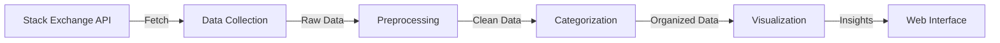

### NLP Knowledge Base - Source Code

> 🚀 The data pipeline that powers the NLP Knowledge Base project, transforming raw Stack Exchange data into organized, categorized knowledge.

[](https://github.com/shubharthaksangharsha/nlp-knowledge-base)
[](https://www.python.org/downloads/)

## 🗺️ Directory Structure

```
src/
├── 📥 data_collector.py    # Stack Exchange API integration
├── 🧹 preprocessor.py      # Data cleaning and text preprocessing
├── 📊 data_visualizer.py   # Visualization generation
├── 🏷️ categorizer.py       # Post categorization logic
├── 🎯 main.py             # Pipeline orchestration
└── 📦 __init__.py         # Package initialization
```

## 🔨 Components

### 1. 📥 Data Collection (`data_collector.py`)
- 🔌 Integrates with Stack Exchange API
- 📡 Fetches NLP-related Q&A
- ⚡ Smart rate limiting and pagination
- 🔄 Incremental updates support

### 2. 🧹 Data Preprocessing (`preprocessor.py`)
- 🧼 Text cleaning and normalization
- 🔧 HTML entity handling
- 💻 Code block preservation
- 📝 Content standardization

### 3. 📊 Data Visualization (`data_visualizer.py`)
- 📈 Trend analysis and insights
- 🎨 Interactive visualizations
- 🔍 Pattern discovery
- 📉 Usage statistics

### 4. 🏷️ Categorization (`categorizer.py`)
- 🎯 Multi-scheme categorization
- 🤖 Intelligent category assignment
- 📑 Content organization
- 🔄 Dynamic rule updates

### 5. 🎯 Pipeline Orchestration (`main.py`)
- 🔄 End-to-end workflow
- 📝 Comprehensive logging
- ⚠️ Error handling
- 🔍 Progress monitoring

## 🚀 Usage

### Complete Pipeline

```bash
# Run the entire pipeline
python main.py --config config.yaml
```

### Individual Components

```python
from src.data_collector import StackExchangeCollector
from src.preprocessor import DataPreprocessor
from src.categorizer import PostCategorizer
from src.data_visualizer import DataVisualizer

# Collect data
collector = StackExchangeCollector()
raw_data = collector.fetch_data()

# Process and categorize
preprocessor = DataPreprocessor()
categorizer = PostCategorizer()
clean_data = preprocessor.process(raw_data)
categorized_data = categorizer.categorize(clean_data)

# Generate visualizations
visualizer = DataVisualizer()
visualizer.generate_insights(categorized_data)
```

## 📊 Data Flow



## ⚙️ Configuration

### Environment Variables
```bash
STACK_EXCHANGE_API_KEY=your_api_key
MAX_REQUESTS_PER_MINUTE=30
LOG_LEVEL=INFO
```

### Category Rules
```yaml
categories:
  task_based:
    - text_classification
    - sentiment_analysis
  library_based:
    - nltk
    - spacy
    - transformers
```

## 📦 Output

The pipeline generates:
- 📄 JSON/CSV files with categorized posts
- 📊 Visualization assets for web interface
- 📈 Statistics and metadata
- 📝 Processing logs

## 🔍 Monitoring

- 📊 Progress tracking via logging
- ⚠️ Error notifications
- 📈 Performance metrics
- 🔄 Status updates

## 🤝 Contributing

See our [Contributing Guide](../CONTRIBUTING.md) for details on:
- 🐛 Bug reporting
- 💡 Feature suggestions
- 🔧 Development setup
- �� Coding standards 
